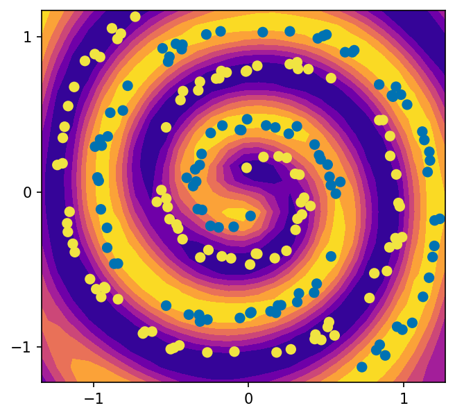

# Gentle Introduction to Quantum Machine Learning

More information in this [article](https://penkovsky.com/post/qml).

## Content

* [spirals_hyperparam.py](spirals_hyperparam.py) - Hyperparameter search
* [spirals_eval.py](spirals_eval.py) - Print out the top five hyperparameter combinations
* [spirals_decision_boundary.py](spirals_decision_boundary.py) - Trained model decision boundary visualization
* [spirals_fidelity.py](spirals_fidelity.py) - Trained model fidelity visualization

## Requirements

    pip install -r requirements.txt
